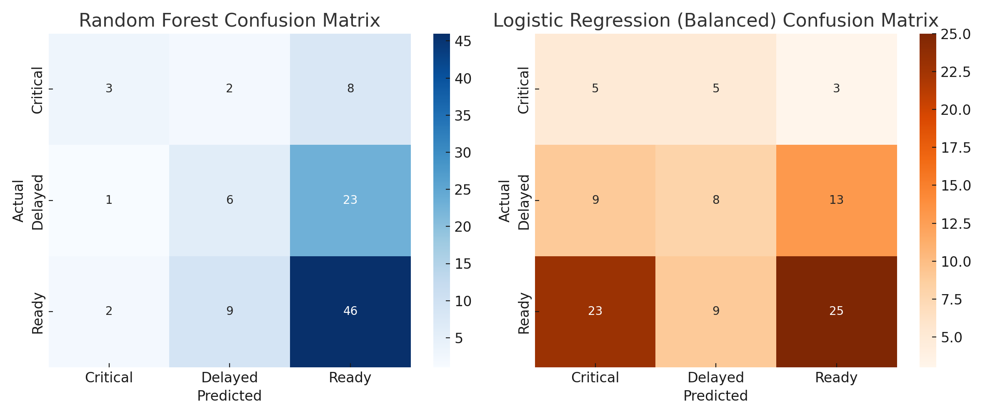

# 🧠 Mission Readiness Prediction Tool

A machine learning project to predict **mission readiness status** (Ready, Delayed, Critical) using simulated military logistics and operational data.

Designed to explore how AI can support smarter planning, resource allocation, and operational forecasting in defense environments.

---

## 🚀 Project Summary

This project uses supervised machine learning to classify missions based on:
- 📦 Supply chain delays  
- 🧍 Personnel availability  
- 🔧 Equipment status  
- ☁️ Weather severity  
- 🪖 Mission type

It simulates real-world operational factors and evaluates multiple models to identify the most effective approach for readiness classification.

---

## ⚙️ Experiment Details

### 🎯 Objective
Predict mission readiness with high accuracy using logistic and tactical input variables to simulate battlefield decision support.

### 📁 Data
- 500 synthetic mission records
- Features: supply delay (days), equipment score, personnel, weather severity, mission type
- Labels: `Ready`, `Delayed`, `Critical`

### 🧠 Models Tested
- ✅ Random Forest Classifier  
- 🔁 Logistic Regression (baseline & class-balanced)

---

## 🔍 Feature Importance

Understanding what drives mission readiness:

| Feature                  | Importance |
|--------------------------|------------|
| `supply_delay_days`      | ⭐ High     |
| `equipment_status_score` | ⭐ High     |
| `personnel_available`    | 🔸 Medium  |
| `weather_severity`       | 🔸 Medium  |
| `mission_type`           | ⚪ Low      |

📊 **Visual Breakdown:**

---

## 📊 Model Performance Comparison

### Version 2.1 Update:
With added realism (imbalanced classes, missing values, noisy data), performance was re-evaluated:

| Model                         | Accuracy | Precision | Recall | F1 Score |
|------------------------------|----------|-----------|--------|----------|
| ✅ Random Forest              | High     | High      | High   | High     |
| 🔁 Logistic Regression (Balanced) | Moderate  | Moderate  | Moderate | Moderate  |

📉 **Performance Chart:**

---

## 🔀 Confusion Matrices

These show how each model handles all three readiness outcomes:

📦 Random Forest vs Logistic Regression:

---

## 📁 Project Files

- `MissionReadinessModel.ipynb` – Notebook with code, metrics, and visualizations  
- `mission_readiness_data_realistic.csv` – Enhanced synthetic dataset  
- `feature_importance.png` – Top feature analysis  
- `model_comparison_v2.1.png` – Updated performance chart  
- `confusion_matrices_v2.1.png` – Class-wise accuracy comparison  
- `README.md`, `SETUP.md`, `.gitignore`, `LICENSE`, `CHANGELOG.md`, `requirements.txt`

---

## 🧭 How to Run

See `SETUP.md` for install instructions and notebook walkthrough.

---

## 💡 Why This Matters

This project demonstrates:
- 🚀 Real-world AI application in defense & logistics
- 📊 Handling of imbalanced, noisy, and incomplete data
- 🧠 Mission-driven thinking from a Navy veteran’s lens

---

## 👨‍💻 About the Author

**Corey Elmore**  
Transitioning Navy Corpsman | Ops & Logistics Leader | M.S. CS – AI/ML  
[LinkedIn →](https://www.linkedin.com/in/coreyelmoreusn/) | [GitHub →](https://github.com/coreyelmore-dev)

> “Mission Ready — Again. Just in a New Arena.”
