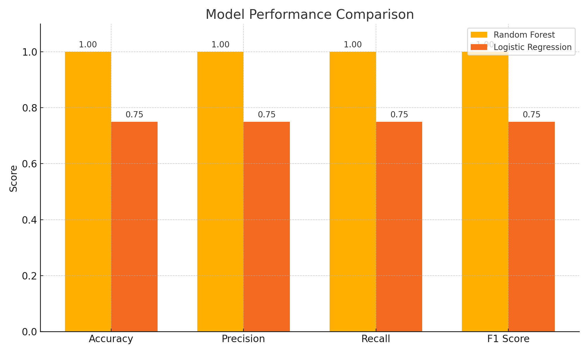

# 🧠 Mission Readiness Prediction Tool

This machine learning project predicts mission readiness using simulated defense logistics and operational data. It demonstrates how AI can support smarter planning, resource allocation, and readiness forecasting in high-stakes environments.

## 🚀 Project Overview

> Predicts whether a mission is **Ready**, **Delayed**, or **Critical** based on:
- Supply delay days
- Personnel availability
- Equipment status score
- Weather severity
- Mission type

Built using:
- ✅ Python
- ✅ Pandas / NumPy
- ✅ Scikit-learn
- ✅ Matplotlib / Seaborn

## 📊 Visuals and Performance

| Model               | Accuracy | Precision | Recall | F1 Score |
|--------------------|----------|-----------|--------|----------|
| Random Forest       | 1.00     | 1.00      | 1.00   | 1.00     |
| Logistic Regression | 0.75     | 0.75      | 0.75   | 0.75     |

📊 **Model Comparison Chart:**

> Based on performance, Random Forest was selected as the final model due to superior accuracy and handling of complex relationships.

## 📁 Project Files

- `MissionReadinessModel.ipynb` — Code, charts, and comparison
- `mission_readiness_data.csv` — Simulated data
- `model_comparison_chart.png` — Visual performance chart
- `requirements.txt` — Easy environment setup
- `.gitignore` and `LICENSE` included

## 📫 About Me

Corey Elmore — Navy veteran, logistics & ops leader, and aspiring AI/ML engineer.  
[LinkedIn](https://www.linkedin.com/in/coreyelmoreusn) | [GitHub](https://github.com/coreyelmore-dev)
